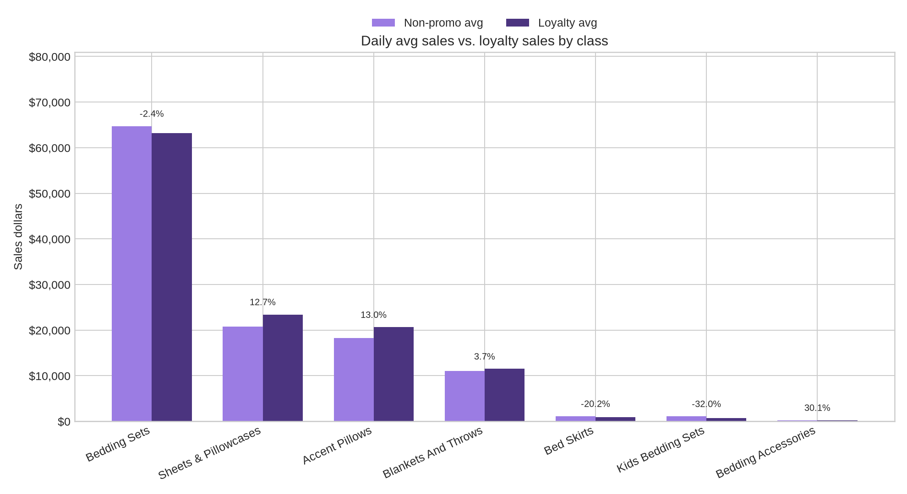
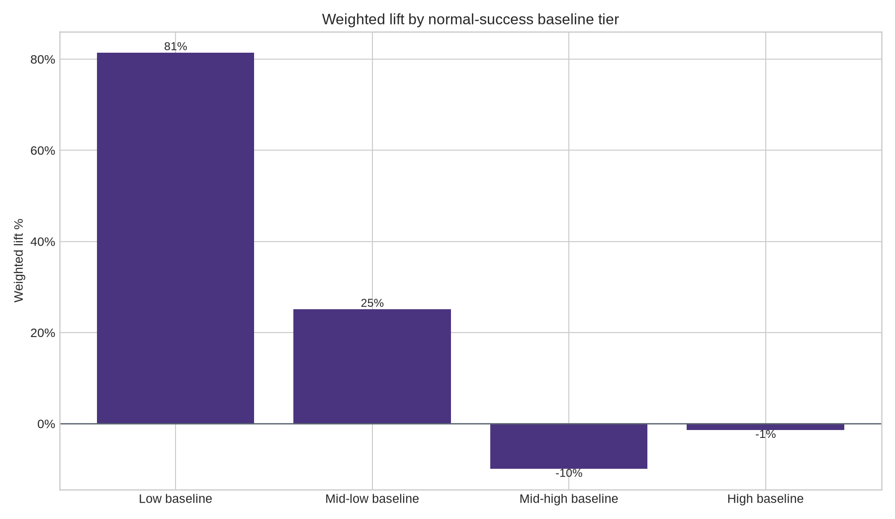
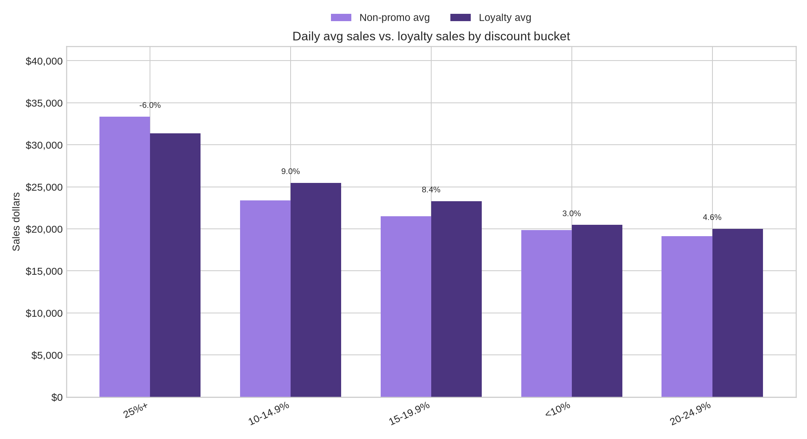
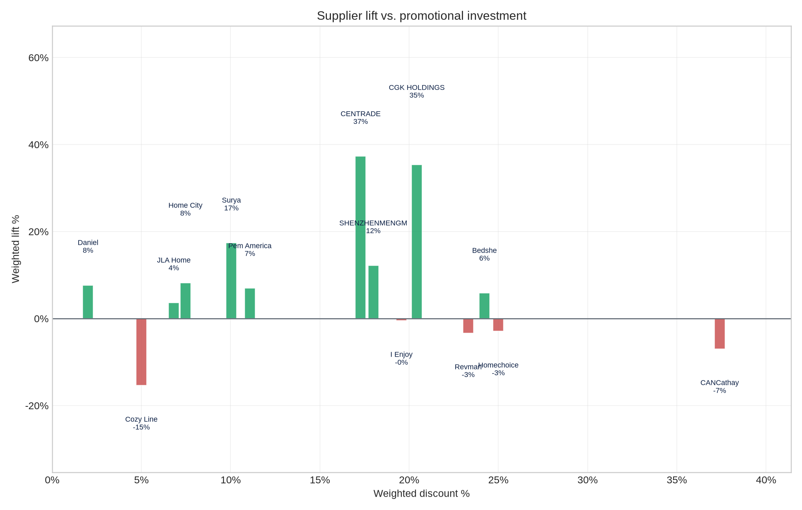
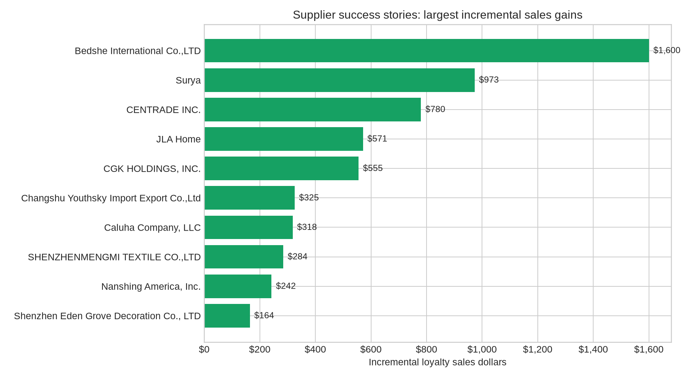

# Bedding Member Monday Performance Case Study

## Executive takeaway

The Bedding Member Monday file generated **$120,625.23** in loyalty sales versus a recent non-promo average of **$117,249.92**, creating **$3,375.31 in incremental sales** and **2.9% weighted lift**.

## What changed during the event

- **Overall lift:** 2.9%
- **Incremental sales:** $3,375.31
- **Participation breadth:** 1769 of 3213 participating SKUs recorded loyalty sales; 1139 SKUs generated positive incremental dollars.
- **Weighted supplier investment:** 18.7% average discount, weighted by non-promo average.
- **Best class by lift:** Bedding Accessories at 30.1%.
- **Largest class by loyalty sales:** Bedding Sets with $63,191.56.

## Are normally successful SKUs performing better or worse?

Using each SKU's non-promo average as a proxy for normal/historical success, the highest-baseline quartile did **not** outperform. High-baseline SKUs (above roughly $39.95 in non-promo average) delivered **-1.3% weighted lift**, while low-baseline SKUs delivered **81.4% weighted lift**.

This suggests the event was better at surfacing incremental demand for lower-baseline or discovery-oriented SKUs than at materially accelerating the already-successful Bedding SKUs. The strongest existing products still generated the majority of sales dollars, but their relative lift was roughly flat/slightly down, so future loyalty events should pair hero SKUs with selective challenger SKUs rather than relying only on historically strong items.

| baseline_success_tier | sku_count | active_skus | positive_lift_sku_rate | weighted_discount_pct | non_promo_avg | loyalty_avg | incremental_sales | weighted_lift_pct |
| --------------------- | --------- | ----------- | ---------------------- | --------------------- | ------------- | ----------- | ----------------- | ----------------- |
| Low baseline          | 626       | 272         | 39.8%                  | 17.7%                 | $2,275.48     | $4,128.66   | $1,853.18         | 81.4%             |
| Mid-low baseline      | 623       | 347         | 42.7%                  | 17.0%                 | $6,280.96     | $7,858.88   | $1,577.92         | 25.1%             |
| Mid-high baseline     | 624       | 436         | 37.5%                  | 16.9%                 | $16,019.84    | $14,435.97  | $-1,583.87        | -9.9%             |
| High baseline         | 624       | 580         | 40.7%                  | 19.1%                 | $92,676.18    | $91,428.05  | $-1,248.13        | -1.3%             |

## Class-level insights

| class_name           | sku_count | active_skus | positive_lift_sku_rate | weighted_discount_pct | non_promo_avg | loyalty_avg | incremental_sales | weighted_lift_pct |
| -------------------- | --------- | ----------- | ---------------------- | --------------------- | ------------- | ----------- | ----------------- | ----------------- |
| Bedding Sets         | 1500      | 857         | 35.5%                  | 20.5%                 | $64,730.39    | $63,191.56  | $-1,538.83        | -2.4%             |
| Sheets & Pillowcases | 260       | 191         | 46.9%                  | 18.4%                 | $20,778.17    | $23,420.46  | $2,642.29         | 12.7%             |
| Accent Pillows       | 1006      | 485         | 34.0%                  | 15.6%                 | $18,262.07    | $20,634.79  | $2,372.72         | 13.0%             |
| Blankets And Throws  | 315       | 166         | 33.0%                  | 13.9%                 | $11,086.48    | $11,502.02  | $415.54           | 3.7%              |
| Bed Skirts           | 37        | 26          | 29.7%                  | 24.5%                 | $1,116.13     | $891.16     | $-224.97          | -20.2%            |
| Kids Bedding Sets    | 76        | 34          | 25.0%                  | 9.1%                  | $1,087.67     | $739.40     | $-348.27          | -32.0%            |
| Bedding Accessories  | 19        | 10          | 42.1%                  | 32.9%                 | $189.01       | $245.84     | $56.83            | 30.1%             |

## Promotional investment vs. lift

| discount_bucket | sku_count | weighted_discount_pct | non_promo_avg | loyalty_avg | incremental_sales | weighted_lift_pct |
| --------------- | --------- | --------------------- | ------------- | ----------- | ----------------- | ----------------- |
| <10%            | 608       | 4.4%                  | $19,872.41    | $20,470.95  | $598.54           | 3.0%              |
| 10-14.9%        | 838       | 10.7%                 | $23,378.83    | $25,482.53  | $2,103.70         | 9.0%              |
| 15-19.9%        | 389       | 16.0%                 | $21,503.60    | $23,303.91  | $1,800.31         | 8.4%              |
| 20-24.9%        | 681       | 20.6%                 | $19,136.65    | $20,020.73  | $884.08           | 4.6%              |
| 25%+            | 697       | 33.4%                 | $33,358.43    | $31,347.11  | $-2,011.32        | -6.0%             |

## Supplier-level insights

| supplier_name                           | sku_count | active_skus | positive_lift_sku_rate | weighted_discount_pct | non_promo_avg | loyalty_avg | incremental_sales | weighted_lift_pct |
| --------------------------------------- | --------- | ----------- | ---------------------- | --------------------- | ------------- | ----------- | ----------------- | ----------------- |
| Bedshe International Co.,LTD            | 185       | 136         | 43.2%                  | 24.2%                 | $27,325.75    | $28,925.91  | $1,600.16         | 5.9%              |
| Surya                                   | 256       | 138         | 35.5%                  | 10.0%                 | $5,594.80     | $6,567.54   | $972.74           | 17.4%             |
| CENTRADE INC.                           | 38        | 20          | 50.0%                  | 17.3%                 | $2,092.55     | $2,872.52   | $779.97           | 37.3%             |
| JLA Home                                | 359       | 250         | 40.7%                  | 7.2%                  | $15,739.80    | $16,310.86  | $571.06           | 3.6%              |
| CGK HOLDINGS, INC.                      | 13        | 13          | 69.2%                  | 20.0%                 | $1,572.42     | $2,127.71   | $555.29           | 35.3%             |
| Changshu Youthsky Import Export Co.,Ltd | 18        | 13          | 66.7%                  | 5.0%                  | $572.00       | $897.25     | $325.25           | 56.9%             |
| Caluha Company, LLC                     | 34        | 19          | 52.9%                  | 14.5%                 | $378.31       | $696.43     | $318.12           | 84.1%             |
| SHENZHENMENGMI TEXTILE CO.,LTD          | 8         | 8           | 50.0%                  | 18.0%                 | $2,336.10     | $2,620.32   | $284.22           | 12.2%             |
| Nanshing America, Inc.                  | 44        | 25          | 45.5%                  | 10.9%                 | $605.48       | $847.71     | $242.23           | 40.0%             |
| Shenzhen Eden Grove Decoration Co., LTD | 3         | 1           | 33.3%                  | 18.0%                 | $188.40       | $352.41     | $164.01           | 87.1%             |
| Home City Inc.                          | 68        | 38          | 38.2%                  | 7.0%                  | $1,916.25     | $2,073.41   | $157.16           | 8.2%              |
| 11243098 Canada Inc                     | 5         | 5           | 80.0%                  | 5.0%                  | $102.43       | $258.06     | $155.63           | 151.9%            |
| nanyangdingjiayueshangmaoyouxiangongsi  | 6         | 6           | 50.0%                  | 10.0%                 | $200.22       | $349.59     | $149.37           | 74.6%             |
| Trade-Linker                            | 13        | 9           | 53.8%                  | 11.4%                 | $457.87       | $594.58     | $136.71           | 29.9%             |
| MANDY LI COLLECTION                     | 1         | 1           | 100.0%                 | 20.0%                 | $3.07         | $130.09     | $127.02           | 4137.5%           |

## Supplier success stories

The largest incremental supplier win was **Bedshe International Co.,LTD**, with **$1,600.16** in incremental sales and **5.9%** weighted lift.

## Files generated

- `bedding_member_monday_sku_data.csv`: cleaned SKU-level extract.
- `class_summary.csv`: class-level performance.
- `supplier_summary.csv`: supplier-level performance.
- `discount_bucket_summary.csv`: lift by discount-investment bucket.
- `baseline_success_tier_summary.csv`: normal-success tier performance.
- `bedding_member_monday_case_study.xlsx`: workbook with all summary tabs.
- `charts/*.png`: visual assets for supplier-facing materials.
