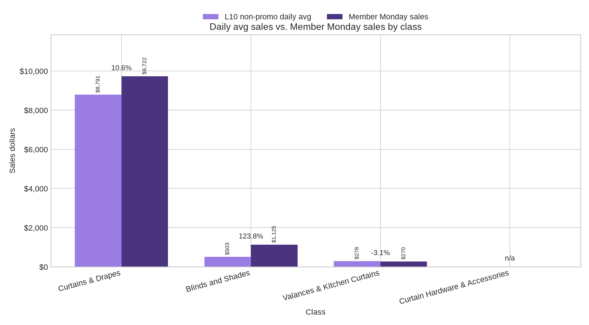
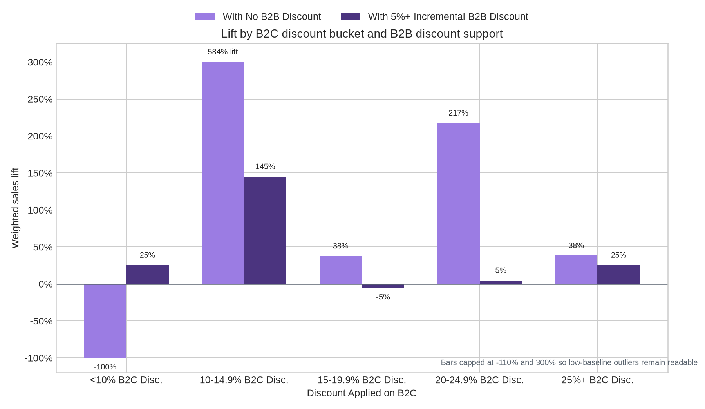
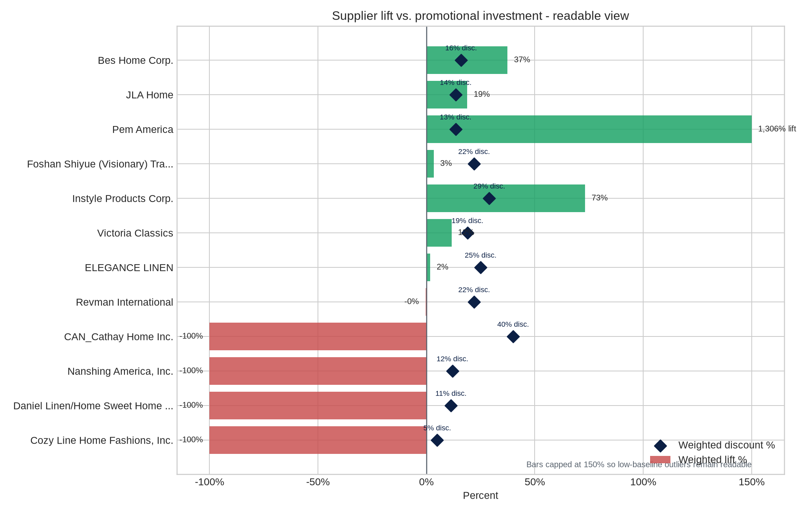
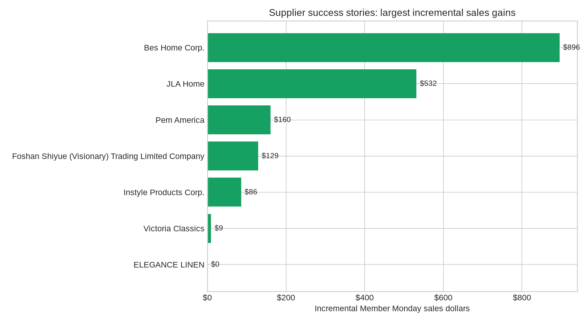

# Member Monday Loyalty Lift Case Study: Window Category

## Executive takeaway

Member Monday generated **$11,116.60** in participating SKU sales versus a recent non-promo daily average of **$9,571.97**, creating **$1,544.63 in incremental sales** and a **16.1% weighted lift**. The event gives suppliers a practical proof point that loyalty-led traffic can move window-category demand when promotion depth is paired with the right SKU selection.

**Important reading note:** the source file compares a one-day Member Monday result to each SKU's recent non-promo daily average. I treat the `Discount` field as the supplier promotional investment level and calculate portfolio lift as `(Member Monday Sales - L10 Non Promo Daily Avg) / L10 Non Promo Daily Avg`.

**Data QA note:** The cleaned SKU-detail reconstruction ties to the PDF total within $0.04 on the baseline and $0.01 on Member Monday sales.

## Metric definitions

- **Active SKUs:** participating SKUs that had more than `$0` in Member Monday sales. It answers, "How many of the submitted SKUs actually sold during the event?"
- **Lift per discount point:** weighted sales lift divided by weighted discount investment. For example, a value of `2.0` means the supplier generated about 2 percentage points of sales lift for every 1 percentage point of discount. Use it as an efficiency read, not a margin or dollar ROI calculation.
- **Weighted lift:** total incremental sales divided by the total recent non-promo daily average for that group.
- **Weighted discount:** the `Discount` field averaged by baseline sales, so higher-volume SKUs influence the supplier/class average more than low-volume SKUs.

## What changed on Member Monday

- **Overall lift:** 16.1% on $11,116.60 in Member Monday sales.
- **Incremental sales:** $1,544.63 above the recent non-promo daily average.
- **Participation breadth:** 51 of 372 participating SKUs recorded Member Monday sales; 35 SKUs generated positive incremental dollars.
- **Weighted supplier investment:** 17.7% average `Discount` rate, weighted by the recent non-promo daily average.
- **Best class by lift:** Blinds and Shades at 123.8% weighted lift.
- **Largest class by event sales:** Curtains & Drapes with $9,721.98 in Member Monday sales.

## Class-level insights

| class_name                     | sku_count | active_skus | positive_lift_sku_rate | weighted_discount_pct | l10_non_promo_daily_avg | member_monday_sales | incremental_sales | weighted_lift_pct |
| ------------------------------ | --------- | ----------- | ---------------------- | --------------------- | ----------------------- | ------------------- | ----------------- | ----------------- |
| Curtains & Drapes              | 278       | 38          | 9.0%                   | 17.6%                 | $8,791.00               | $9,721.98           | $930.98           | 10.6%             |
| Blinds and Shades              | 22        | 4           | 18.2%                  | 18.2%                 | $502.66                 | $1,124.80           | $622.14           | 123.8%            |
| Valances & Kitchen Curtains    | 64        | 9           | 9.4%                   | 17.4%                 | $278.35                 | $269.83             | $-8.52            | -3.1%             |
| Curtain Hardware & Accessories | 8         | 0           | 0.0%                   | 15.0%                 | $0.00                   | $0.00               | $0.00             | n/a               |

### How to use these class insights with suppliers

- **Lead with the proof point:** Blinds and Shades delivered the strongest class-level lift, showing that even specialized window classes respond when promoted through the loyalty event.
- **Separate scale from rate:** Curtains & Drapes produced the largest Member Monday dollar volume, while smaller classes can show higher lift rates because their baseline is lower.
- **Use the active-SKU rate as a merchandising filter:** classes with many participating SKUs but fewer active SKUs should be reviewed for search placement, inventory, and item attractiveness before simply increasing discount depth.

## Promotional investment vs. lift

| discount_bucket | sku_count | weighted_discount_pct | l10_non_promo_daily_avg | member_monday_sales | incremental_sales | weighted_lift_pct |
| --------------- | --------- | --------------------- | ----------------------- | ------------------- | ----------------- | ----------------- |
| <10%            | 43        | 5.9%                  | $1,142.52               | $1,170.95           | $28.43            | 2.5%              |
| 10-14.9%        | 39        | 12.0%                 | $97.67                  | $380.75             | $283.08           | 289.8%            |
| 15-19.9%        | 157       | 16.1%                 | $4,035.88               | $4,876.10           | $840.22           | 20.8%             |
| 20-24.9%        | 72        | 22.0%                 | $3,955.82               | $4,241.79           | $285.97           | 7.2%              |
| 25%+            | 61        | 27.0%                 | $340.12                 | $447.02             | $106.90           | 31.4%             |

The investment story is not purely "deeper discount equals better lift." Mid- and higher-discount buckets both produced wins, but SKU relevance and baseline demand materially shaped outcomes. This is a useful supplier message: Member Monday works best when suppliers fund a compelling offer **and** nominate SKUs with enough demand signal to convert loyalty traffic.

## Supplier-level insights

| supplier_name                                     | sku_count | active_skus | positive_lift_sku_rate | weighted_discount_pct | l10_non_promo_daily_avg | member_monday_sales | incremental_sales | weighted_lift_pct |
| ------------------------------------------------- | --------- | ----------- | ---------------------- | --------------------- | ----------------------- | ------------------- | ----------------- | ----------------- |
| Bes Home Corp.                                    | 78        | 8           | 7.7%                   | 16.0%                 | $2,393.13               | $3,288.68           | $895.55           | 37.4%             |
| JLA Home                                          | 82        | 27          | 18.3%                  | 13.5%                 | $2,822.79               | $3,354.29           | $531.50           | 18.8%             |
| Pem America                                       | 25        | 2           | 8.0%                   | 13.5%                 | $12.28                  | $172.66             | $160.38           | 1306.0%           |
| Foshan Shiyue (Visionary) Trading Limited Company | 43        | 7           | 11.6%                  | 22.0%                 | $3,823.79               | $3,953.00           | $129.21           | 3.4%              |
| Instyle Products Corp.                            | 1         | 1           | 100.0%                 | 29.0%                 | $117.16                 | $202.91             | $85.75            | 73.2%             |
| Victoria Classics                                 | 29        | 2           | 6.9%                   | 18.9%                 | $81.23                  | $90.64              | $9.41             | 11.6%             |
| ELEGANCE LINEN                                    | 25        | 2           | 8.0%                   | 25.0%                 | $19.89                  | $20.24              | $0.35             | 1.8%              |
| Trade-Linker                                      | 1         | 0           | 0.0%                   | 12.0%                 | $0.00                   | $0.00               | $0.00             | n/a               |
| SAF IJAZ                                          | 3         | 0           | 0.0%                   | 7.0%                  | $0.00                   | $0.00               | $0.00             | n/a               |
| Penson & Co.                                      | 8         | 0           | 0.0%                   | 15.0%                 | $0.00                   | $0.00               | $0.00             | n/a               |
| Cloud9 Design Inc.                                | 6         | 0           | 0.0%                   | 10.0%                 | $0.00                   | $0.00               | $0.00             | n/a               |
| ocean home fashion inc                            | 6         | 0           | 0.0%                   | 11.0%                 | $0.00                   | $0.00               | $0.00             | n/a               |
| Xinyun Keji (Shanghai) Trading Co., Ltd.          | 3         | 0           | 0.0%                   | 26.7%                 | $0.00                   | $0.00               | $0.00             | n/a               |
| Revman International                              | 17        | 2           | 11.8%                  | 22.0%                 | $34.33                  | $34.19              | $-0.14            | -0.4%             |
| CAN_Cathay Home Inc.                              | 8         | 0           | 0.0%                   | 40.0%                 | $13.07                  | $0.00               | $-13.07           | -100.0%           |

## Supplier success stories

| supplier_name                                     | sku_count | active_skus | positive_lift_sku_rate | weighted_discount_pct | l10_non_promo_daily_avg | member_monday_sales | incremental_sales | weighted_lift_pct |
| ------------------------------------------------- | --------- | ----------- | ---------------------- | --------------------- | ----------------------- | ------------------- | ----------------- | ----------------- |
| Bes Home Corp.                                    | 78        | 8           | 7.7%                   | 16.0%                 | $2,393.13               | $3,288.68           | $895.55           | 37.4%             |
| JLA Home                                          | 82        | 27          | 18.3%                  | 13.5%                 | $2,822.79               | $3,354.29           | $531.50           | 18.8%             |
| Pem America                                       | 25        | 2           | 8.0%                   | 13.5%                 | $12.28                  | $172.66             | $160.38           | 1306.0%           |
| Foshan Shiyue (Visionary) Trading Limited Company | 43        | 7           | 11.6%                  | 22.0%                 | $3,823.79               | $3,953.00           | $129.21           | 3.4%              |
| Instyle Products Corp.                            | 1         | 1           | 100.0%                 | 29.0%                 | $117.16                 | $202.91             | $85.75            | 73.2%             |
| Victoria Classics                                 | 29        | 2           | 6.9%                   | 18.9%                 | $81.23                  | $90.64              | $9.41             | 11.6%             |
| ELEGANCE LINEN                                    | 25        | 2           | 8.0%                   | 25.0%                 | $19.89                  | $20.24              | $0.35             | 1.8%              |

### Storylines for supplier conversations

1. **Scaled incremental win:** Bes Home Corp. produced the largest positive incremental sales gain at **$895.55** over baseline, with **$3,288.68** in Member Monday sales.
2. **Scaled efficiency win:** Bes Home Corp. paired meaningful scale with efficient lift, generating **37.4%** lift at a **16.0%** weighted discount.
3. **Low-baseline breakout:** Pem America produced the highest supplier lift rate among positive suppliers. Use this as an upside story, but frame it as a low-baseline result that should be validated with repeat events.
4. **Assortment learning:** suppliers with many participating SKUs but low active-SKU rates are candidates for tighter SKU curation. The event can still work, but the next round should prioritize items with stronger recent traffic, inventory, imagery, and price competitiveness.

## Recommended supplier-facing message

> Member Monday created measurable incremental demand in the window category. Across participating SKUs, the event lifted sales **16.1%** above recent non-promo daily averages. The strongest results came when suppliers paired meaningful discount funding with SKUs that already had enough customer demand to convert loyalty traffic. For the next event, we should use this case study to ask suppliers for targeted funding on proven SKUs, then expand selectively into similar items/classes.

## Files generated

- `member_monday_sku_data.csv`: cleaned SKU-level extract.
- `class_summary.csv`: class-level performance and investment metrics.
- `supplier_summary.csv`: supplier-level performance and investment metrics.
- `discount_bucket_summary.csv`: lift by supplier discount-investment bucket.
- `member_monday_case_study.xlsx`: workbook with all summary tabs.
- `charts/*.png`: visual assets for supplier-facing materials.
