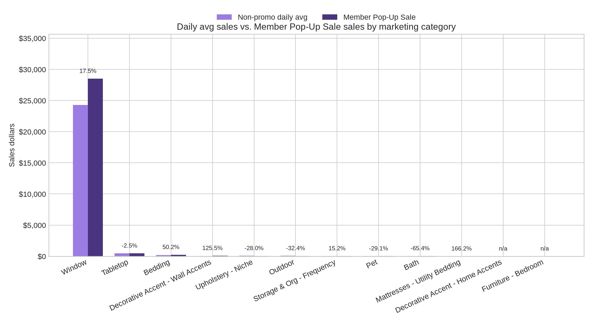
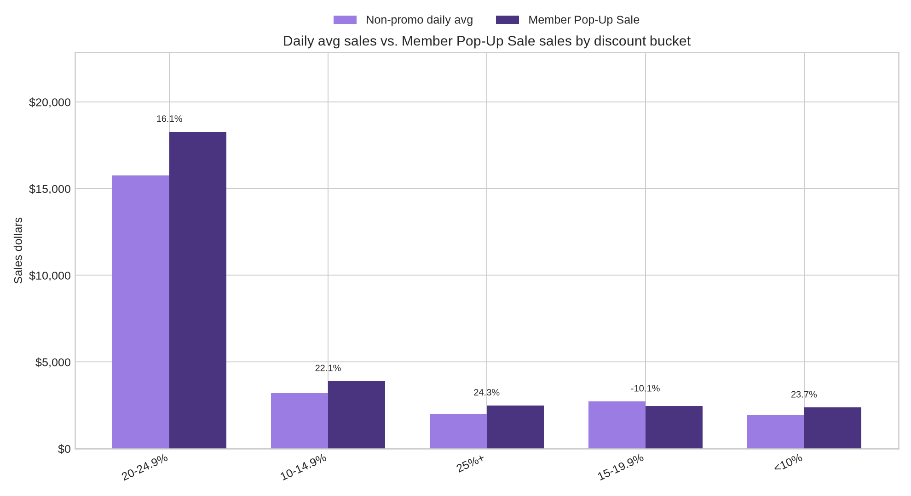
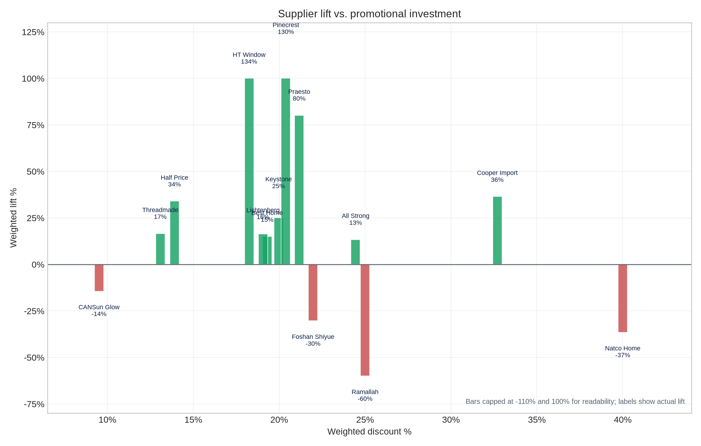
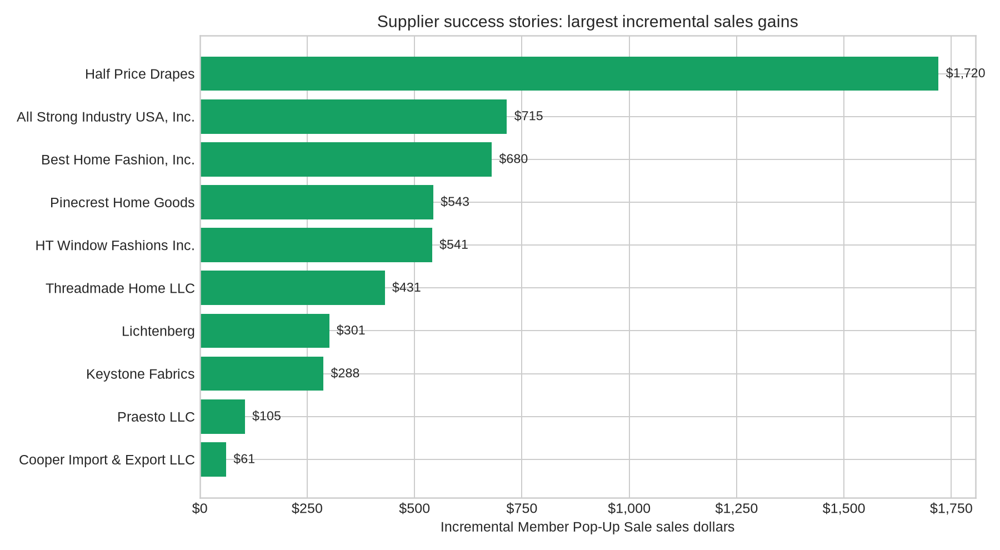

# Member Pop-Up Sale Loyalty Lift Case Study

## Executive takeaway

The Member Pop-Up Sale generated **$29,484.19** in event sales versus a recent non-promo daily average of **$25,584.65**, creating **$3,899.54 in incremental sales** and **15.2% weighted lift**.

**Data QA note:** The displayed CSV total is used for the headline. Cleaned SKU-detail rows sum to $25,584.85 baseline sales and $29,484.19 event sales.

## What changed during the Member Pop-Up Sale

- **Overall lift:** 15.2%
- **Incremental sales:** $3,899.54
- **Participation breadth:** 303 of 2123 participating SKUs recorded event sales; 226 SKUs generated positive incremental dollars.
- **Weighted supplier investment:** 19.4% average discount, weighted by recent non-promo daily average.
- **Largest marketing category by event sales:** Window with $28,513.66.
- **Best marketing category by lift:** Bedding at 50.2%.

## Marketing-category insights

| marketing_category               | sku_count | active_skus | positive_lift_sku_rate | weighted_discount_pct | non_promo_daily_avg | member_pop_up_sales | incremental_sales | weighted_lift_pct |
| -------------------------------- | --------- | ----------- | ---------------------- | --------------------- | ------------------- | ------------------- | ----------------- | ----------------- |
| Window                           | 772       | 239         | 22.0%                  | 19.5%                 | $24,275.42          | $28,513.66          | $4,238.24         | 17.5%             |
| Tabletop                         | 437       | 43          | 8.7%                   | 14.0%                 | $478.10             | $466.24             | $-11.86           | -2.5%             |
| Bedding                          | 81        | 10          | 12.3%                  | 21.3%                 | $161.63             | $242.80             | $81.17            | 50.2%             |
| Decorative Accent - Wall Accents | 18        | 2           | 11.1%                  | 25.0%                 | $39.05              | $88.04              | $48.99            | 125.5%            |
| Upholstery - Niche               | 5         | 2           | 20.0%                  | 17.2%                 | $69.22              | $49.85              | $-19.37           | -28.0%            |
| Outdoor                          | 17        | 1           | 0.0%                   | 16.3%                 | $64.53              | $43.63              | $-20.90           | -32.4%            |
| Storage & Org - Frequency        | 9         | 1           | 11.1%                  | 41.6%                 | $30.62              | $35.28              | $4.66             | 15.2%             |
| Pet                              | 4         | 2           | 50.0%                  | 25.0%                 | $26.55              | $18.82              | $-7.73            | -29.1%            |
| Bath                             | 18        | 2           | 5.6%                   | 26.9%                 | $48.11              | $16.66              | $-31.45           | -65.4%            |
| Mattresses - Utility Bedding     | 1         | 1           | 100.0%                 | 20.0%                 | $3.46               | $9.21               | $5.75             | 166.2%            |
| Decorative Accent - Home Accents | 1         | 0           | 0.0%                   | 49.0%                 | $0.00               | $0.00               | $0.00             | n/a               |
| Furniture - Bedroom              | 10        | 0           | 0.0%                   | 13.8%                 | $0.00               | $0.00               | $0.00             | n/a               |
| Lighting                         | 5         | 0           | 0.0%                   | 20.0%                 | $0.00               | $0.00               | $0.00             | n/a               |
| Seasonal Decor                   | 7         | 0           | 0.0%                   | 12.9%                 | $0.00               | $0.00               | $0.00             | n/a               |
| Upholstery - Core                | 2         | 0           | 0.0%                   | 16.0%                 | $0.00               | $0.00               | $0.00             | n/a               |

## Promotional investment vs. lift

| discount_bucket | sku_count | weighted_discount_pct | non_promo_daily_avg | member_pop_up_sales | incremental_sales | weighted_lift_pct |
| --------------- | --------- | --------------------- | ------------------- | ------------------- | ----------------- | ----------------- |
| <10%            | 47        | 5.4%                  | $1,919.78           | $2,374.09           | $454.31           | 23.7%             |
| 10-14.9%        | 359       | 10.6%                 | $3,190.27           | $3,895.83           | $705.56           | 22.1%             |
| 15-19.9%        | 794       | 17.0%                 | $2,721.82           | $2,446.05           | $-275.77          | -10.1%            |
| 20-24.9%        | 367       | 21.9%                 | $15,750.16          | $18,279.05          | $2,528.89         | 16.1%             |
| 25%+            | 556       | 30.2%                 | $2,002.82           | $2,489.17           | $486.35           | 24.3%             |

## Supplier-level insights

| supplier_name                 | sku_count | active_skus | positive_lift_sku_rate | weighted_discount_pct | non_promo_daily_avg | member_pop_up_sales | incremental_sales | weighted_lift_pct |
| ----------------------------- | --------- | ----------- | ---------------------- | --------------------- | ------------------- | ------------------- | ----------------- | ----------------- |
| Half Price Drapes             | 85        | 40          | 36.5%                  | 13.9%                 | $5,063.07           | $6,783.36           | $1,720.29         | 34.0%             |
| All Strong Industry USA, Inc. | 44        | 34          | 54.5%                  | 24.4%                 | $5,346.73           | $6,061.83           | $715.10           | 13.4%             |
| Best Home Fashion, Inc.       | 187       | 58          | 23.0%                  | 20.5%                 | $4,527.01           | $5,206.73           | $679.72           | 15.0%             |
| Pinecrest Home Goods          | 19        | 1           | 5.3%                   | 20.0%                 | $418.12             | $961.60             | $543.48           | 130.0%            |
| HT Window Fashions Inc.       | 37        | 7           | 16.2%                  | 18.2%                 | $402.25             | $943.08             | $540.83           | 134.5%            |
| Threadmade Home LLC           | 520       | 72          | 11.9%                  | 13.1%                 | $2,599.26           | $3,029.94           | $430.68           | 16.6%             |
| Lichtenberg                   | 102       | 46          | 26.5%                  | 19.1%                 | $1,832.38           | $2,133.54           | $301.16           | 16.4%             |
| Keystone Fabrics              | 9         | 7           | 44.4%                  | 20.4%                 | $1,148.93           | $1,436.74           | $287.81           | 25.1%             |
| Praesto LLC                   | 6         | 3           | 50.0%                  | 20.0%                 | $130.79             | $235.61             | $104.82           | 80.1%             |
| Cooper Import & Export LLC    | 2         | 2           | 100.0%                 | 32.7%                 | $167.72             | $228.86             | $61.14            | 36.5%             |
| OPT FASHION GROUP INC.        | 76        | 2           | 2.6%                   | 30.0%                 | $4.68               | $2.96               | $-1.72            | -36.8%            |
| CAN_Sun Glow                  | 94        | 2           | 1.1%                   | 9.5%                  | $95.76              | $82.00              | $-13.76           | -14.4%            |
| Ramallah Trading Company      | 47        | 4           | 8.5%                   | 25.0%                 | $40.10              | $16.06              | $-24.04           | -60.0%            |
| India's Heritage              | 20        | 1           | 0.0%                   | 33.7%                 | $60.26              | $14.98              | $-45.28           | -75.1%            |
| Natco Home                    | 83        | 6           | 7.2%                   | 40.0%                 | $130.44             | $82.75              | $-47.69           | -36.6%            |

## Supplier success stories

The largest incremental supplier win was **Half Price Drapes**, with **$1,720.29** in incremental sales and **34.0%** weighted lift.

## Class-level support detail

| class_name                      | sku_count | active_skus | positive_lift_sku_rate | weighted_discount_pct | non_promo_daily_avg | member_pop_up_sales | incremental_sales | weighted_lift_pct |
| ------------------------------- | --------- | ----------- | ---------------------- | --------------------- | ------------------- | ------------------- | ----------------- | ----------------- |
| Curtains & Drapes               | 510       | 161         | 22.4%                  | 18.3%                 | $15,163.77          | $16,908.97          | $1,745.20         | 11.5%             |
| Blinds and Shades               | 189       | 53          | 19.6%                  | 23.2%                 | $7,694.54           | $9,897.10           | $2,202.56         | 28.6%             |
| Curtain Hardware & Accessories  | 22        | 12          | 36.4%                  | 10.9%                 | $1,296.30           | $1,470.80           | $174.50           | 13.5%             |
| Dining Linens                   | 241       | 37          | 12.9%                  | 14.1%                 | $339.44             | $411.89             | $72.45            | 21.3%             |
| Valances & Kitchen Curtains     | 51        | 13          | 21.6%                  | 21.2%                 | $120.81             | $236.79             | $115.98           | 96.0%             |
| Bedding Sets                    | 24        | 2           | 12.5%                  | 21.6%                 | $102.27             | $119.39             | $17.12            | 16.7%             |
| Wall & Accent Mirrors           | 15        | 2           | 13.3%                  | 25.0%                 | $39.05              | $88.04              | $48.99            | 125.5%            |
| Accent Pillows                  | 30        | 4           | 10.0%                  | 14.7%                 | $31.51              | $73.69              | $42.18            | 133.9%            |
| Slipcovers                      | 5         | 2           | 20.0%                  | 17.2%                 | $69.22              | $49.85              | $-19.37           | -28.0%            |
| Blankets And Throws             | 19        | 4           | 21.1%                  | 27.8%                 | $24.59              | $49.72              | $25.13            | 102.2%            |
| Placemats, Chargers, & Napkins  | 171       | 5           | 3.5%                   | 13.8%                 | $137.47             | $45.42              | $-92.05           | -67.0%            |
| Hammocks                        | 17        | 1           | 0.0%                   | 16.3%                 | $64.53              | $43.63              | $-20.90           | -32.4%            |
| Boxes, Bins, Baskets, & Buckets | 2         | 1           | 50.0%                  | 50.0%                 | $23.29              | $35.28              | $11.99            | 51.5%             |
| Dog Beds & Mats                 | 3         | 2           | 66.7%                  | 25.0%                 | $26.55              | $18.82              | $-7.73            | -29.1%            |
| Shower Curtains                 | 11        | 2           | 9.1%                   | 5.0%                  | $13.05              | $16.66              | $3.61             | 27.7%             |
| Standard Bed Pillow             | 1         | 1           | 100.0%                 | 20.0%                 | $3.46               | $9.21               | $5.75             | 166.2%            |
| Kitchen Towels                  | 12        | 1           | 8.3%                   | 10.0%                 | $1.19               | $8.93               | $7.74             | 650.4%            |
| Accent Stools                   | 3         | 0           | 0.0%                   | 50.0%                 | $0.00               | $0.00               | $0.00             | n/a               |
| Bedding Accessories             | 3         | 0           | 0.0%                   | 35.0%                 | $0.00               | $0.00               | $0.00             | n/a               |
| Benches                         | 1         | 0           | 0.0%                   | 16.0%                 | $0.00               | $0.00               | $0.00             | n/a               |

## Files generated

- `member_pop_up_sale_sku_data.csv`: cleaned SKU-level extract.
- `marketing_category_summary.csv`: marketing-category performance.
- `class_summary.csv`: class-level performance.
- `supplier_summary.csv`: supplier-level performance.
- `discount_bucket_summary.csv`: lift by discount-investment bucket.
- `member_pop_up_sale_case_study.xlsx`: workbook with all summary tabs.
- `charts/*.png`: visual assets for supplier-facing materials.
