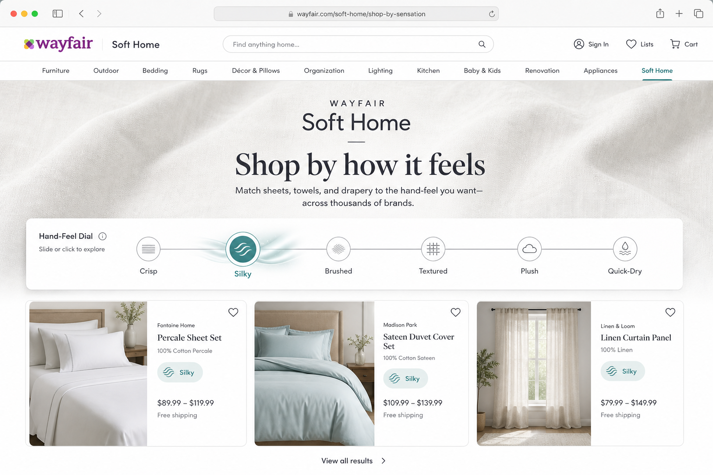
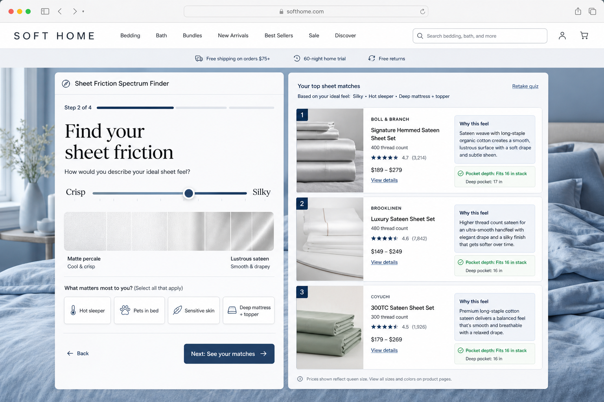
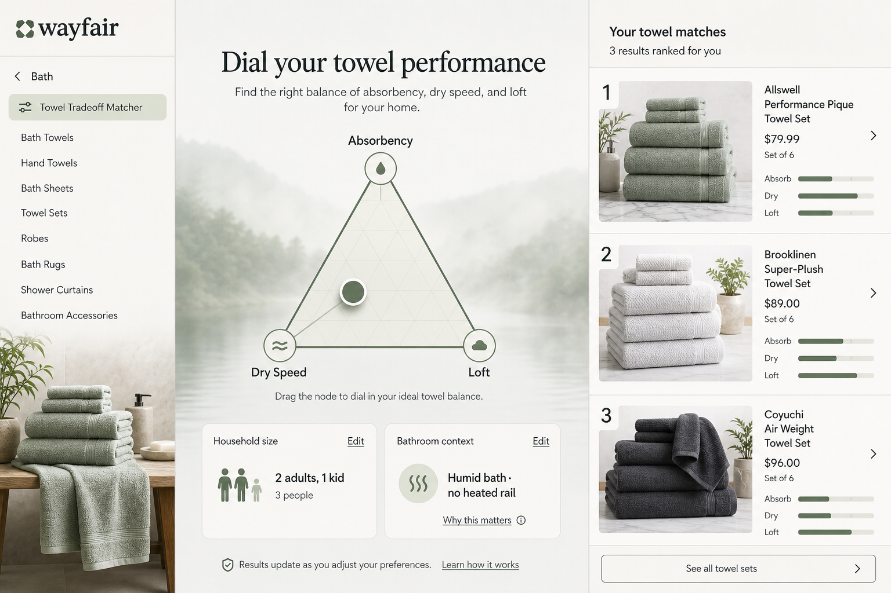
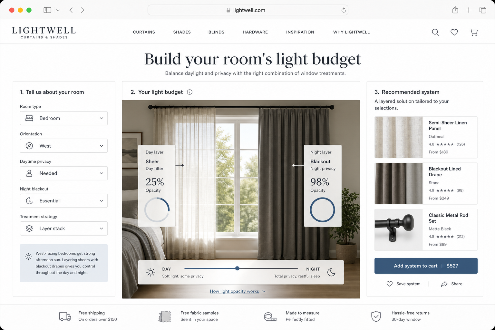
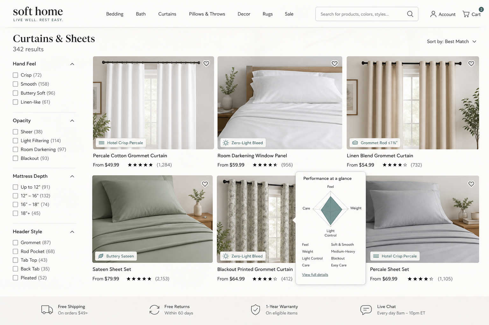
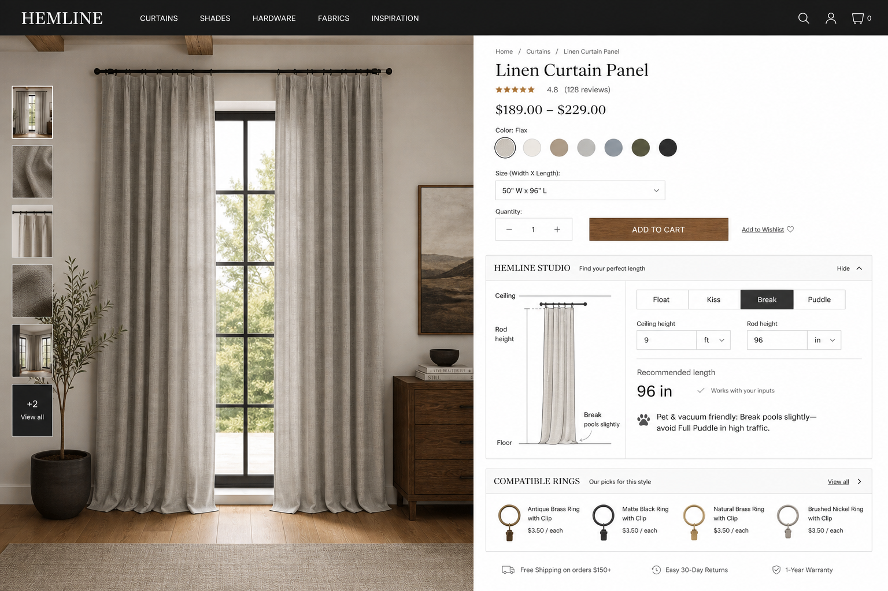
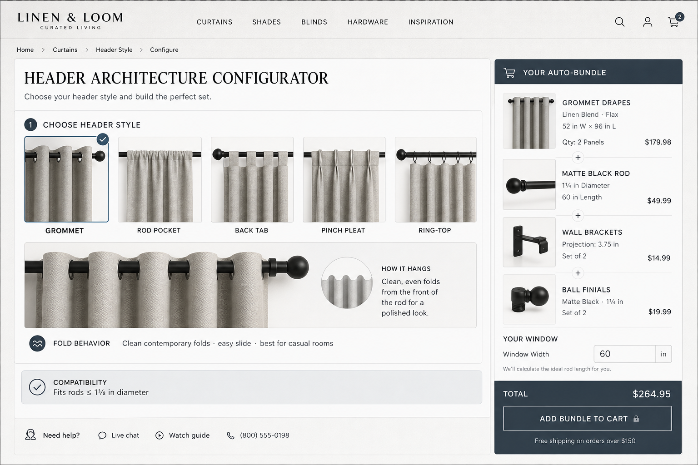
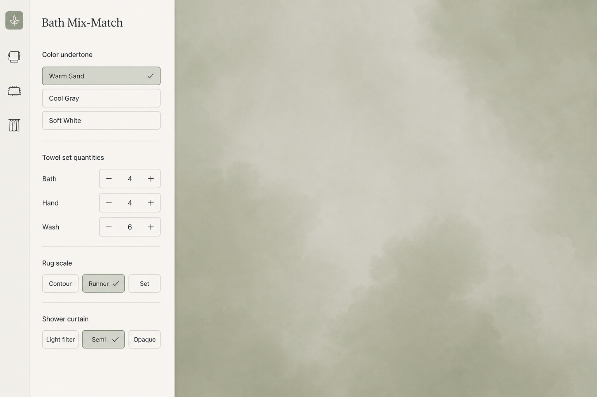

# Soft Home Competitor Audit → Novel Merchandising Initiatives

**Categories:** Bedding · Bath · Window Treatments  
**Audience:** Soft Home CM / PM / Merchandising / Storefront  
**Purpose:** Forward-looking, net-new digital merchandising mechanics Wayfair can adopt or elevate across the shopping funnel—grounded in competitor UX patterns and Wayfair’s broad-supplier catalog advantage.

---

## How to read this document

Initiatives are grouped by **funnel surface** (Upper Funnel → ICP → Superbrowse/PLP → PDP). Each idea is designed to go beyond baseline Soft Home merch (seasonal hubs, static GSM drawers, simple thermal cross-sells) and instead attack tactile hesitation, fit/return friction, styling uncertainty, and incomplete project baskets.

**Category balance:** Bedding · Bath · Window · Cross-Category appear in each major stage.  
**Effort mix:** quick-win badge/facet plays sit alongside strategic interactive tools.

**Internal alignment notes (non-duplicative):** These concepts complement—not replace—existing Soft Home workstreams (STS competitor audits, Amazon filter-parity, schema centralization, option thumbnails, Window 4+ joins, return-verbatim PDP audits, Catalyst environmental imagery, Back-to-College filters). Where relevant, Required Catalog Data calls out attributes already in schema rationalization pipelines.

**Visual mockups:** Concept UI comps live in [`mockups/`](./mockups/) and are embedded below selected initiatives so you can see how each mechanic would read on-site.

---

## 1. Upper Funnel (Top Nav · Homepage · Seasonal / Solution Hubs)

### `Hand-Feel Navigation: Shop Soft Home by Sensation`

- **Surface / Funnel Stage:** Upper Funnel
- **Primary Category:** Cross-Category (Bedding + Bath primary; Window fabric families secondary)
- **Competitor Inspiration & Benchmark:** Brooklinen / Parachute / Boll & Branch organize discovery around weave personality (crisp percale vs buttery sateen vs lived-in linen) but keep it mostly within brand storytelling and PDP copy. Half Price Drapes groups curtains by fabric families (velvet, linen, faux silk) with distinct “character” language. Neither launches a sitewide **sensory nav** that maps tactile vocabulary to multi-supplier SKUs.
- **Wayfair Merchandising Concept & Differentiator:** Replace commodity category tiles with a **Hand-Feel Dial** in Soft Home top-nav / homepage modules: *Crisp · Silky · Brushed · Textured · Plush · Lightweight Quick-Dry*. Each dial position animates a micro-proxy (sheet friction glide, towel loft “bounce,” drape weight swing) and routes to a curated multi-supplier assortment—not a single private brand. Wayfair wins by translating supplier fabric specs into one sensory taxonomy customers can shop without knowing weave jargon.
- **Customer Problem Solved / Friction Removed:** “I can’t feel it online” and brand-blind tactile uncertainty that tanks Soft Home consideration vs specialty DTC.
- **Required Catalog Data & Class Tags:** `hand_feel_cluster` (enum), weave type, fiber family, finish (brushed/peach/washed), pile height / terry construction, fabric weight band, drape weight class; supplier-approved sensory synonym tags.
- **Implementation Feasibility & Effort:** Medium — requires governance map from raw specs → 6–8 sensory clusters; quick pilot on Sheets + Towels before Window fabrics.
- **Expected Commercial Impact:** Consideration & PDPVR lift in Soft Home; Conversion Rate ↑ among first-time Soft Home buyers; Return Rate ↓ on “not as soft / too thin / too stiff” themes.

---

### `Microclimate Soft Home Hub (ZIP + Weather Triggers)`

- **Surface / Funnel Stage:** Upper Funnel
- **Primary Category:** Cross-Category
- **Competitor Inspiration & Benchmark:** SelectBlinds / Blinds.com surface motorization and blackout as lifestyle solutions; Amazon and Target lean on seasonal event merchandising. Few competitors personalize Soft Home hubs by **local humidity, UV index, and temperature swing**—most stop at generic “winter bedding” or promo calendars.
- **Wayfair Merchandising Concept & Differentiator:** A dynamic hub that swaps modules by ZIP/weather signal: high humidity → mildew-resistant bath mats, quick-dry towels, moisture-wicking sheets; high UV → fade-resistant drapery + UV-filtering shades; large diurnal swings → layered window kits (sheer day / insulating night). Distinct from basic seasonal bedding—this is **climate problem merchandising** across all three Soft Home classes.
- **Customer Problem Solved / Friction Removed:** Seasonal relevance without forcing a single national narrative; surfaces problem-fit products before customers know the right keyword.
- **Required Catalog Data & Class Tags:** moisture_wicking, antimicrobial/mildew-resistant, fade_resistance, UV_filter_rating, thermal_r_value / insulating, quick_dry_claim, opacity_grade; geo eligibility for shipping SLAs.
- **Implementation Feasibility & Effort:** Medium–High — weather personalization + tag coverage; start with manually curated climate “modes” before full ZIP automation.
- **Expected Commercial Impact:** Homepage CTR → Soft Home; AOV ↑ via multi-category kits; Attach Rate ↑ (window layering + bath moisture systems).

---

### `Quiet Hours Hub: Acoustic Soft Home for Focus & Sleep`

- **Surface / Funnel Stage:** Upper Funnel
- **Primary Category:** Window (with Bedding attach)
- **Competitor Inspiration & Benchmark:** The Shade Store and SelectBlinds emphasize custom craft, motorization, and blackout; cellular/honeycomb shades are often sold as energy products. Acoustic / WFH “sound calm” is rarely a first-class Soft Home story online—usually buried in FAQ copy.
- **Wayfair Merchandising Concept & Differentiator:** Upper-funnel hub: *Street Noise · Shared Walls · Nursery · Zoom Room*. Merchandises cellular shades, heavy lined drapery, layered sheer+blackout systems, and noise-adjacent bedding (weighted blankets, denser weaves) as a **room-acoustic system**, not isolated SKUs. Pair with short sound-dampen explainers (what cellular cells do vs lined drapery) without becoming a static “what is R-value” drawer.
- **Customer Problem Solved / Friction Removed:** Shoppers don’t search “NRC rating”—they search peace and privacy; this captures intent competitors leave on the table.
- **Required Catalog Data & Class Tags:** construction_type (cellular/honeycomb, lined, interlined), fabric_weight, lining_type, mount_depth, opacity_grade, room_use_tags (nursery, office); optional supplier acoustic claims with legal review.
- **Implementation Feasibility & Effort:** Medium — curation + education modules; High if claiming measured acoustic performance (prefer directional language unless lab data exists).
- **Expected Commercial Impact:** Window AOV ↑ (layering + hardware); Conversion Rate ↑ on high-consideration custom-adjacent brows; Attach Rate ↑ Bedding.

---

## 2. Category Landing Pages & ICPs (Interactive Finders · Visual Configurators)

### `Sheet Friction Spectrum Finder`

- **Surface / Funnel Stage:** ICP
- **Primary Category:** Bedding
- **Competitor Inspiration & Benchmark:** Casper’s mattress quiz personalizes comfort via sleep position/body type; Brooklinen/Parachute educate on percale vs sateen via editorial comparison. Missing: an interactive **continuum** that also factors laundry reality, pets, sensitive skin, and mattress depth—then maps to a multi-brand Wayfair shelf.
- **Wayfair Merchandising Concept & Differentiator:** Multi-step finder: (1) place yourself on a Crisp ↔ Silky slider, (2) hot/cool preference as a secondary axis (not the only one), (3) constraints (pets, acne-prone/sensitive skin, deep mattress + topper stack), (4) care tolerance (wrinkle OK / low-iron). Output is a ranked shortlist with **why this feel** cards and pocket-depth pass/fail—not a single hero SKU. Elevates beyond “cold sleeper badge” into a decision engine for a supplier-diverse catalog.
- **Customer Problem Solved / Friction Removed:** Weave jargon paralysis; wrong-feel returns; deep-pocket misfits on hybrid mattresses.
- **Required Catalog Data & Class Tags:** weave, fiber, finish, thread_count_band (display carefully), pocket_depth_in, OEKO-TEX/GOTS flags, pet_hair_resistance proxy (tight weave / brushed), hypoallergenic claims, wrinkle_behavior tag.
- **Implementation Feasibility & Effort:** Medium — quiz UX + scoring rules; depends on pocket_depth & weave completeness (align with Sheets schema enrichment).
- **Expected Commercial Impact:** Conversion Rate ↑; Return Rate ↓ (feel + fit); AOV ↑ via matched pillowcases / protectors.

---

### `Towel Tradeoff Matcher: Absorb · Dry · Loft`

- **Surface / Funnel Stage:** ICP
- **Primary Category:** Bath
- **Competitor Inspiration & Benchmark:** Pottery Barn’s Hydrocotton story sells hollow-yarn absorbency + quicker dry as a brand proprietary narrative; Target Threshold lists vague GSM bands. Neither gives shoppers an explicit **three-way tradeoff tool** (max absorbency vs fastest dry vs plush loft) across many suppliers.
- **Wayfair Merchandising Concept & Differentiator:** Interactive triangle control: drag toward Absorbency, Dry Speed, or Loft; results re-rank towels and recommend set composition (bath/hand/wash ratios for household size). Include bathroom context (humid bath without heated rail → bias dry speed; spa primary bath → bias loft). Positions Wayfair Basics + premium suppliers on the same performance map.
- **Customer Problem Solved / Friction Removed:** GSM-as-quality myth; mildew/slow-dry remorse; set-building confusion.
- **Required Catalog Data & Class Tags:** GSM (or weight band), terry construction (loop/hydro/twisted), yarn_type, dry_time_band, absorbency_band, piece dimensions, set_piece_count, color continuity IDs for mix-and-match.
- **Implementation Feasibility & Effort:** Medium — needs standardized absorb/dry bands (supplier tests or CM-assigned proxies); Low for household-size set math once dimensions exist.
- **Expected Commercial Impact:** AOV ↑ (complete sets); Return Rate ↓; Attach Rate ↑ (rugs/hooks coordinated later).

---

### `Window Light Budget Calculator`

- **Surface / Funnel Stage:** ICP
- **Primary Category:** Window
- **Competitor Inspiration & Benchmark:** Half Price Drapes publishes explicit opacity percentages (sheer ~20% → blackout 90–100%) on listings; Blinds.com / SelectBlinds excel at measurement education and Fit guarantees; The Shade Store leads with free measure + swatches. Few turn opacity into a **room light-budget simulator** that recommends layering strategies.
- **Wayfair Merchandising Concept & Differentiator:** Customer inputs room type, orientation (N/S/E/W), need for daytime privacy vs night blackout, and whether they want one treatment or a layer stack. Tool outputs a “light budget” plan (e.g., sheer day filter + night blackout) with compatible SKUs and hardware. Surpasses static opacity badges by teaching **systems shopping** across Wayfair’s ready-made + custom-adjacent assortment.
- **Customer Problem Solved / Friction Removed:** Room-darkening vs blackout confusion; side-light leakage surprises; under-buying single panels / wrong opacity.
- **Required Catalog Data & Class Tags:** opacity_percent or opacity_grade, lined/unlined, light_block_claim_type, panel_vs_pair, header_style, recommended_fullness_multiplier, mount_type compatibility.
- **Implementation Feasibility & Effort:** Medium — opacity taxonomy must be governed (align with Window schema); High for true lux simulation (start with discrete grades + layer recipes).
- **Expected Commercial Impact:** Conversion Rate ↑; Return Rate ↓ (opacity expectation); AOV ↑ via layering + rods.

---

### `Small-Bath Geometry Finder`

- **Surface / Funnel Stage:** ICP
- **Primary Category:** Bath
- **Competitor Inspiration & Benchmark:** IKEA wins compact-living planning with dimensional clarity; specialty bath brands rarely help with **vanity gap, toilet clearance, and tub vs shower curtain length** as one interactive flow. Wayfair’s own bath-rug dimensional schema work makes this uniquely executable.
- **Wayfair Merchandising Concept & Differentiator:** Upload or select bath layout presets (galley, powder, tub/shower combo). Finder checks rug footprint vs door swing, recommends runner vs contour vs set, and maps shower curtain length to tub apron vs stall. Bundles hardware (rings, tension rod vs permanent) that clears tile constraints.
- **Customer Problem Solved / Friction Removed:** Wrong rug scale; curtain too short/long; returns from “doesn’t fit my tiny bath.”
- **Required Catalog Data & Class Tags:** rug L×W, contour cutout presence, curtain length, rod type/min-max width, pile height (door clearance), non-slip backing.
- **Implementation Feasibility & Effort:** Medium — layout presets first (no AR); Low effort facet packaging once dimensions are clean.
- **Expected Commercial Impact:** Return Rate ↓; Attach Rate ↑ (rug + curtain + rod + hooks); Conversion Rate ↑ in Bath Rugs/Curtains.

---

## 3. Superbrowse / PLP (Listview · Facets · Badging · Spec Surfacing)

### `Tactile Performance Badges with Hover Spec Graphs`

- **Surface / Funnel Stage:** Superbrowse / PLP
- **Primary Category:** Cross-Category
- **Competitor Inspiration & Benchmark:** Amazon/Target use social-proof and deal badges; specialty sites use sparse “crisp percale” copy. Soft Home returns often stem from mismatched tactile expectations (linen-look roughness, thin sheers, heavy velvet). Prior Wayfair return themes on curtains (opacity, single-panel, texture) reinforce the need for **expectation-setting badges**, not just “Bestseller.”
- **Wayfair Merchandising Concept & Differentiator:** PLP badges such as *Hotel Crisp Percale*, *Buttery Sateen*, *Plush High-Loft Terry*, *Zero-Light Bleed*, *Daylight Soft Filter*, *Grommet Rod ≤1⅜″*—each with hover mini-radar (Feel / Weight / Light Control / Care). Differentiator: badges are **spec-derived and comparable across suppliers**, not marketing fluff.
- **Customer Problem Solved / Friction Removed:** Scannable tactile confidence on browse; reduces PDP bounce from “what does this actually feel like?”
- **Required Catalog Data & Class Tags:** Same sensory/opacity/header attributes as above; badge eligibility rules; legal-approved claim language.
- **Implementation Feasibility & Effort:** Low–Medium — quick win once cluster tags exist; governance to prevent badge spam.
- **Expected Commercial Impact:** PLP CTR → PDP ↑; Conversion Rate ↑; Return Rate ↓ on feel/opacity mismatches.

---

### `Swatch-in-Light Hover States`

- **Surface / Funnel Stage:** Superbrowse / PLP
- **Primary Category:** Window (extend to Bedding/Bath textiles)
- **Competitor Inspiration & Benchmark:** The Shade Store / SelectBlinds push free physical swatches; Pottery Barn and RH invest in true-to-life color storytelling. Digital competitors rarely simulate **north-light vs warm lamp** on the same swatch at browse.
- **Wayfair Merchandising Concept & Differentiator:** On color chip hover, cycle fabric under Cool Daylight / Warm Evening / Backlit (for sheers). Leverages option-thumbnail programs and reduces “color looked different” returns called out in Soft Home curtain remorse analyses—at catalog scale.
- **Customer Problem Solved / Friction Removed:** Color/undertone discrepancy; sheer vs solid appearance under backlight.
- **Required Catalog Data & Class Tags:** option thumbnail assets, undertone notes, sheer/backlit image tags, color family mapping.
- **Implementation Feasibility & Effort:** Medium — needs 2–3 lighting assets per hero color or generative Catalyst variants with QA.
- **Expected Commercial Impact:** Return Rate ↓ (color); Conversion Rate ↑ on neutrals/sheers; sample-request attach where enabled.

---

### `Hardware Compatibility Facets (Rod ↔ Header ↔ Bracket)`

- **Surface / Funnel Stage:** Superbrowse / PLP
- **Primary Category:** Window
- **Competitor Inspiration & Benchmark:** Half Price Drapes publishes grommet inner diameter limits vs rod diameter; RH measuring guides account for rings/header take-up. Mass retailers often leave rod/drape compatibility as tribal knowledge.
- **Wayfair Merchandising Concept & Differentiator:** Facets: *Fits rods ≤ X″*, *Requires rings*, *Back-tab compatible*, *Ceiling-mount clearance*. When a drape is selected, PLP can soft-filter rods/finials. Turns Wayfair’s hardware breadth into a fit engine competitors with narrower assortments can’t match.
- **Customer Problem Solved / Friction Removed:** Grommet/rod mismatch returns; incomplete window projects.
- **Required Catalog Data & Class Tags:** header_style, grommet_id, rod_max_diameter, ring_required, pocket_size, bracket_projection, weight capacity.
- **Implementation Feasibility & Effort:** Medium — attribute completeness + facet UX; High for live bidirectional filtering.
- **Expected Commercial Impact:** Attach Rate ↑ (hardware); Return Rate ↓; AOV ↑.

---

### `Mattress-Depth Fit Chips on Sheet PLPs`

- **Surface / Funnel Stage:** Superbrowse / PLP
- **Primary Category:** Bedding
- **Competitor Inspiration & Benchmark:** Cozy Earth and other DTC sheet brands loudly market deep pockets (e.g., up to 20″). On broadline sites, pocket depth is often buried in specs, so shoppers filter late—or after a return.
- **Wayfair Merchandising Concept & Differentiator:** Persistent PLP chip: “Fits mattresses up to X″” with optional stack helper (mattress + protector + topper). Filter: *Standard · Deep · Extra Deep*. Surfaces fit confidence at browse, not only PDP.
- **Customer Problem Solved / Friction Removed:** Fitted-sheet pop-off; deep hybrid mattress misfit.
- **Required Catalog Data & Class Tags:** pocket_depth_in, fits_up_to_mattress_depth, size, stretch_fabric flag.
- **Implementation Feasibility & Effort:** Low — classic quick win if pocket depth coverage is prioritized in supplier outreach.
- **Expected Commercial Impact:** Conversion Rate ↑; Return Rate ↓; Attach Rate ↑ (protectors sized to same depth story).

---

## 4. Product Detail Page (Content Order · Hierarchy · Cross-Sell Engines)

### `Hemline Studio: Float · Kiss · Break · Puddle`

- **Surface / Funnel Stage:** PDP
- **Primary Category:** Window
- **Competitor Inspiration & Benchmark:** RH’s drapery measuring PDFs define tailored float vs puddle degrees (1″ break → 10″+ puddle) and warn against puddling high-traffic panels—but the guidance is PDF/static. Pottery Barn / West Elm sell standard lengths without an interactive hemline preview tied to rod height.
- **Wayfair Merchandising Concept & Differentiator:** On curtain PDPs, an interactive side elevation: customer sets ceiling height, rod height, and desired hemline mode; tool recommends length SKU/option and shows pet/vacuum practicality warnings for puddle. Auto-suggests rings vs pocket measurement adjustments. Elevates RH education into a **conversion widget** across thousands of supplier panels.
- **Customer Problem Solved / Friction Removed:** Length remorse; “too short / pooling dirt” returns; ring take-up mistakes.
- **Required Catalog Data & Class Tags:** available lengths, header_style, ring_drop_in, fabric_weight (puddle suitability), panel_count included.
- **Implementation Feasibility & Effort:** Medium — reusable PDP module; Low once length options are structured.
- **Expected Commercial Impact:** Return Rate ↓ (length); Conversion Rate ↑; AOV ↑ (correct longer lengths / custom-adj).

---

### `Header Architecture Configurator + Hardware Auto-Bundle`

- **Surface / Funnel Stage:** PDP
- **Primary Category:** Window
- **Competitor Inspiration & Benchmark:** Half Price Drapes’ Pleat & Header Guide and “shop by header” pairs experience; SelectBlinds step-through customizers for lift/mount. Wayfair can out-assort them on ready-made variety if configuration clarity matches specialty UX.
- **Wayfair Merchandising Concept & Differentiator:** PDP drawer: pick visual header (grommet / rod pocket / back tab / pinch / ring-top). Show fold behavior animation, open/close suitability, and **compatible rod diameter / ring count**. One-click add compatible rod + brackets + finials sized to window width input. Feeds future 4+ joins for semi-custom window.
- **Customer Problem Solved / Friction Removed:** Styling uncertainty; incomplete baskets; incompatible hardware.
- **Required Catalog Data & Class Tags:** header_style, compatibility graph to hardware SKUs, recommended_fullness, weight, finish_match keys (metal/wood tones).
- **Implementation Feasibility & Effort:** High for full auto-bundle graph; Medium for header picker + manual curated attach sets per class.
- **Expected Commercial Impact:** Attach Rate ↑↑; AOV ↑; Return Rate ↓ (compatibility).

---

### `Mattress Stack Fit Checker (Sheets · Pads · Toppers · Protectors)`

- **Surface / Funnel Stage:** PDP
- **Primary Category:** Bedding
- **Competitor Inspiration & Benchmark:** Casper quiz optimizes mattress comfort; DTC sheet brands advertise pocket depth in isolation. Almost no one models the **stacked height** shoppers actually sleep on (mattress + pad + topper + protector).
- **Wayfair Merchandising Concept & Differentiator:** PDP module: enter mattress depth + add-on depths (or pick common Wayfair pad/topper SKUs). Pass/fail fitted-sheet pocket; recommend deeper pocket or stretch-fit alternatives; cross-sell matching depth-compatible protector. Solves a systemic return driver competitors ignore because they sell fewer utility-bedding adjacencies—Wayfair’s catalog is the advantage.
- **Customer Problem Solved / Friction Removed:** “Sheets don’t fit with my topper” returns; sizing confusion across utility bedding.
- **Required Catalog Data & Class Tags:** pocket_depth, product_height for pads/toppers/protectors, elastic_type, size.
- **Implementation Feasibility & Effort:** Medium — arithmetic UX + clean depth attributes across classes.
- **Expected Commercial Impact:** Return Rate ↓; Attach Rate ↑; Conversion Rate ↑ on deep-pocket premium sheets.

---

### `Bath Mix-Match Studio (Towels · Rugs · Shower)`

- **Surface / Funnel Stage:** PDP
- **Primary Category:** Bath
- **Competitor Inspiration & Benchmark:** Pottery Barn sells coordinated bath collections with strong brand color stories; Parachute/Brooklinen do bedding-centric brand ecosystems. Wayfair’s challenge is coordinating **across suppliers** without a single house look.
- **Wayfair Merchandising Concept & Differentiator:** From any bath towel PDP: open Mix-Match as a **left-nav control rail** (not a full “Build Your Bathroom” canvas)—lock a color undertone family, then set towel quantities, rug scale (from Small-Bath geometry outputs if available), and shower curtain opacity/pattern scale. Uses color_family IDs rather than forcing one brand. Keeps the interaction compact so shoppers refine the system without leaving the PDP browse context.
- **Customer Problem Solved / Friction Removed:** Styling uncertainty; incomplete bath refresh; mismatched undertones.
- **Required Catalog Data & Class Tags:** color_family, undertone, dimensions, opacity for curtains, set composition rules.
- **Implementation Feasibility & Effort:** Medium–High — cross-class relationship graph; Medium if starting with curated colorways on top sellers.
- **Expected Commercial Impact:** AOV ↑↑; Attach Rate ↑; Conversion Rate ↑ on bath projects.

---

### `Problem-Solution Bundle Rails (Not Thermal Cross-Sells)`

- **Surface / Funnel Stage:** PDP (also injectable on ICP)
- **Primary Category:** Cross-Category
- **Competitor Inspiration & Benchmark:** Buffy / Casper / Cozy Earth sell lifestyle problem frames (hot sleep, eco softness) within brand walls. Broadlines show “customers also bought.” Missing: **governed problem bundles** that span Soft Home classes with explicit friction removal.
- **Wayfair Merchandising Concept & Differentiator:** PDP rails driven by problem tags, examples:
  - *Pet-Hair Resistant Bed System* (tight-weave sheets + washable coverlets + lint-resistant throws)
  - *Acne-Safe / Sensitive-Skin Bath Routine* (OEKO-TEX towels, fragrance-free care notes, quick-dry to reduce damp bacteria risk)
  - *Drafty-Room Insulation Kit* (cellular shade + lined drape + door-adjacent draft strategies—window-first, not comforter-first)
  - *Light-Sleeper Blackout Stack* (true blackout + side-bleed hardware guidance + eye-mask-adjacent bedding only as tertiary)
  
  Explicitly **not** “warm comforter → breathable sheets” thermal defaults.
- **Customer Problem Solved / Friction Removed:** Project incompleteness; wrong adjacent attaches; returns from unsolved root problem.
- **Required Catalog Data & Class Tags:** problem_tags taxonomy, certification flags, construction proxies (tight weave, cellular, lined), compatibility rules.
- **Implementation Feasibility & Effort:** Medium — merchandising taxonomy + rail templates; Low for manual hero bundles on top return SKUs.
- **Expected Commercial Impact:** Attach Rate ↑; AOV ↑; Return Rate ↓ when bundles set correct expectations.

---

### `Finish & Fabric Coordination Engine (Metals · Woods · Textiles)`

- **Surface / Funnel Stage:** PDP
- **Primary Category:** Cross-Category (Window hardware ↔ Bath hardware ↔ Bedding accent metals)
- **Competitor Inspiration & Benchmark:** RH and CB2 present tightly controlled finish ecosystems; The Shade Store pairs materials in showroom consults. Online mass retail rarely lets a customer lock “champagne bronze” and ripple compatible Soft Home SKUs sitewide.
- **Wayfair Merchandising Concept & Differentiator:** From a curtain rod or towel ring PDP, lock finish family and see validated matches across rods, finials, shower hooks, lamp accents, and bed frame metals already in the order or browse path. Textile recommendations respect undertone (warm metal → warm neutrals). Turns Wayfair’s SKU breadth into a **coordination OS**.
- **Customer Problem Solved / Friction Removed:** Finish mismatch anxiety; abandoned multi-category projects.
- **Required Catalog Data & Class Tags:** finish_family, undertone, sheen_level; textile color_family links; exclusion rules for mixed-metal intentional designs.
- **Implementation Feasibility & Effort:** High at full graph; Medium for top 20 finish families on Window + Bath hardware.
- **Expected Commercial Impact:** Attach Rate ↑; AOV ↑; Conversion Rate ↑ on hardware-led journeys.

---

## Priority Snapshot (Execution View)

| Priority band | Initiatives | Why first |
|---|---|---|
| **Quick wins (Low–Med)** | Mattress-depth PLP chips; Tactile performance badges; Hardware compatibility facets (phase 1); Problem-solution rails on high-return PDPs | Attribute-led; aligns with schema/filter-parity and return audits |
| **Core interactive (Med)** | Sheet Friction Spectrum; Towel Tradeoff Matcher; Hemline Studio; Swatch-in-Light; Small-Bath Geometry | High consideration/return leverage; reusable modules |
| **Platform bets (Med–High)** | Hand-Feel Navigation; Light Budget Calculator; Header Architecture + Auto-Bundle; Finish Coordination Engine; Microclimate / Quiet Hours hubs | Differentiation vs DTC + broadlines; needs taxonomy + personalization |

---

## Competitor Pattern → Wayfair Advantage (Synthesis)

| Competitor pattern | Gap left open | Wayfair elevation |
|---|---|---|
| DTC feel storytelling (Brooklinen, Parachute, Boll & Branch, Cozy Earth) | Single-brand shelf | Sensory taxonomy across suppliers |
| Specialty opacity % & header guides (Half Price Drapes, RH) | Static PDFs / narrow assortment | Interactive hemline + light-budget + hardware graph |
| Measure/Fit guarantees (Blinds.com, SelectBlinds, The Shade Store) | Service-heavy, less ready-made | Digital fit confidence + attach for ready-made majority |
| Brand bath performance stories (Pottery Barn Hydrocotton) | Proprietary yarn narrative | Tradeoff matcher mapping many constructions |
| Mass badges & deals (Amazon, Target, Walmart) | Weak tactile/fit expectation-setting | Spec-derived sensory & fit badges |
| Big-box project DIY (Home Depot, Lowe’s) | Installation-first, soft goods secondary | Soft Home problem hubs (acoustic, climate, small-bath) |

---

## Suggested Measurement Plan

For each shipped initiative, instrument:

1. **Funnel:** module CTR, finder completion rate, PLP filter usage, PDP module engage rate  
2. **Commerce:** CVR, AOV, attach rate (hardware / sets / layering)  
3. **Quality:** return rate and verbatim themes (feel, color, length, opacity, fit, single-panel) on exposed SKUs vs holdout  
4. **Catalog health:** % SKUs eligible for badges/finders (tag coverage)—treat coverage as a leading indicator

---

## Appendix: Explicitly Out of Scope (Baseline — Do Not Duplicate)

These remain useful hygiene but are **not** the ideas in this audit:

- Basic “Winter Bedding” top-nav hubs or standard “Cozy Gifts” guides  
- Generic “Build Your Winter Bed” layer-by-layer graphics  
- Simple “Extra Warm” / “Cold Sleeper” browse badges as the primary story  
- Static “What is Fill Power?” / “What is GSM?” educational drawers without decision tools  
- Simple “Warm comforter → Breathable sheets” thermal cross-sell rails  

The initiatives above replace those patterns with **sensory proxies, fit engines, problem bundles, and cross-supplier coordination mechanics**.
