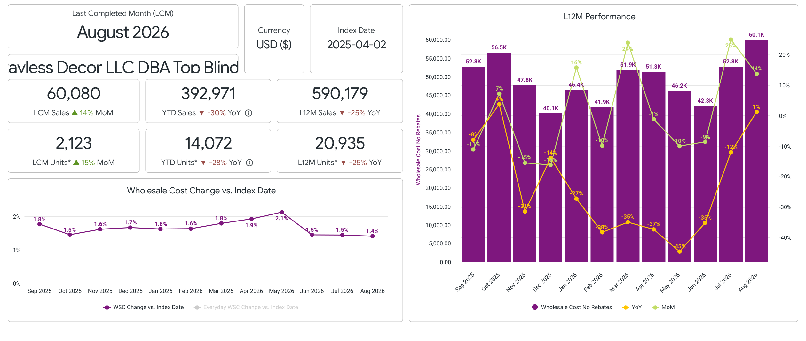
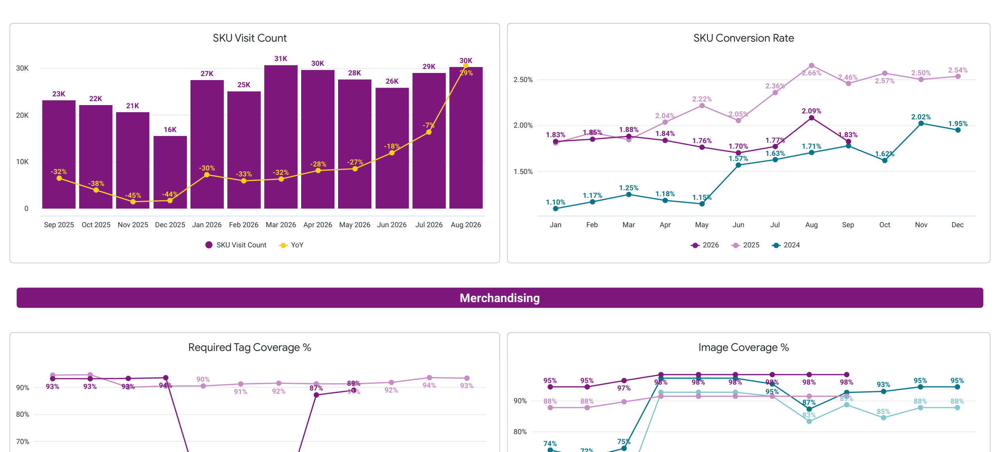
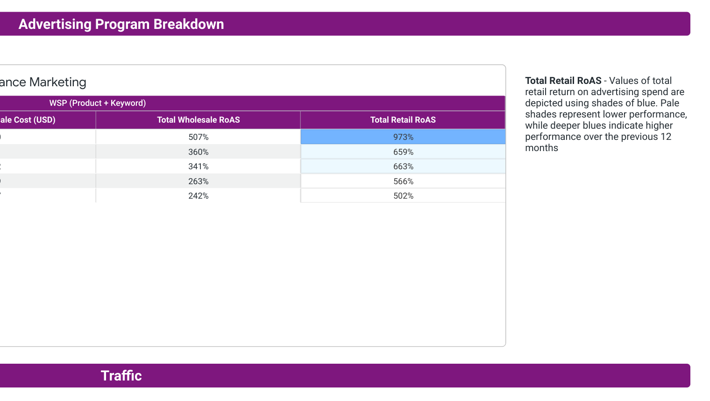
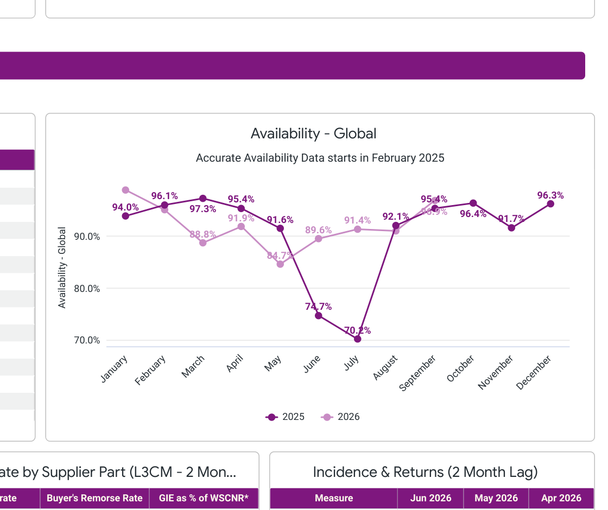

Hi Payless Decor Team,

I’m looking forward to meeting with you and touching base on some future plans!

Brief Agenda:

- I included your August performance below as a reference for you. I'd love to walk through this performance recap to highlight additional areas we can partner together in 2026

- **Business Review August 2026**

- **$60.1K in WSC (+14% MoM, +1% YoY)**
  - MoM trend over indexed the Blinds & Shades Class
  - YoY trend under indexed Blinds & Shades class

- **Traffic:**
  - 30k SKU Visits (+3% MoM, +29% YoY)
    - YoY trend under indexed Blinds & Shades Class
    - MoM trend under indexed Blinds & Shades Class
  - 2.09% CVR in August
    - CVR is over indexing class

- **Advertising**
  - 0.3% of WSC into Advertising (August spend $203; attributed WSC $731; Wholesale RoAS 360%)
  - Do you have any thoughts on the pilot of your advertising program (ie: do you see it working, do you plan on increasing investment?)

- **Branded Competitiveness**
  - *[Add % Uncompetitive + competitiveness chart if you want this section included]*

- Here is a pricing deep dive that we talked through previously: [Cost Stack Report](https://docs.google.com/spreadsheets/d/1_lzlctlUwmhfXdWnn8EjxbzDB8Bmd03Epmbg_xUtDa8/edit?gid=1742226054#gid=1742226054)
  - **Key Point:** This is where I think the most opportunity areas are. I know that we have chatted about this, I just wanted to give you a picture of the progression.

- **Wayfair Professional:**
  - 18% of Sales came from B2B (+42% MoM, +9% YoY)

- **Availability**
  - August Availability: 91.1%
    - Slightly soft MoM (91.4% in July), but still above June (89.6%).

- Dropship performance is excellent. 100% supplier fill rate DS

Please come with any talking points you would like to go through, I imagine there will be some time for any of your agenda items!

Ben
