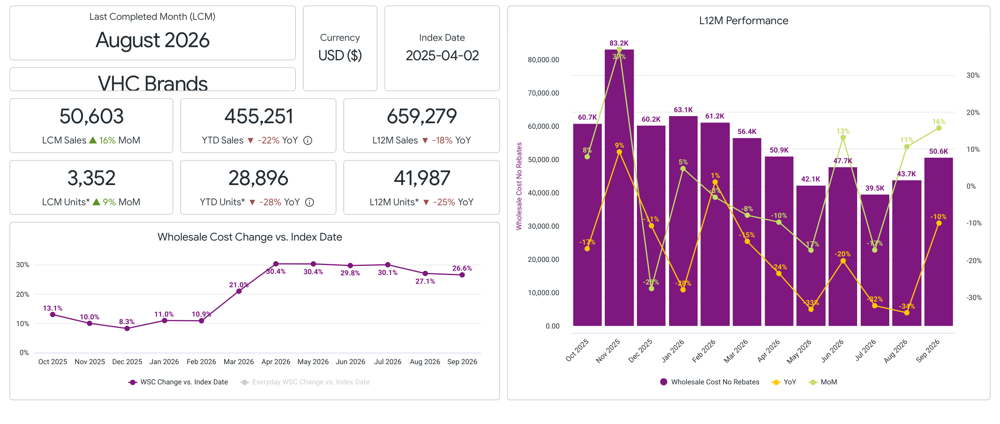
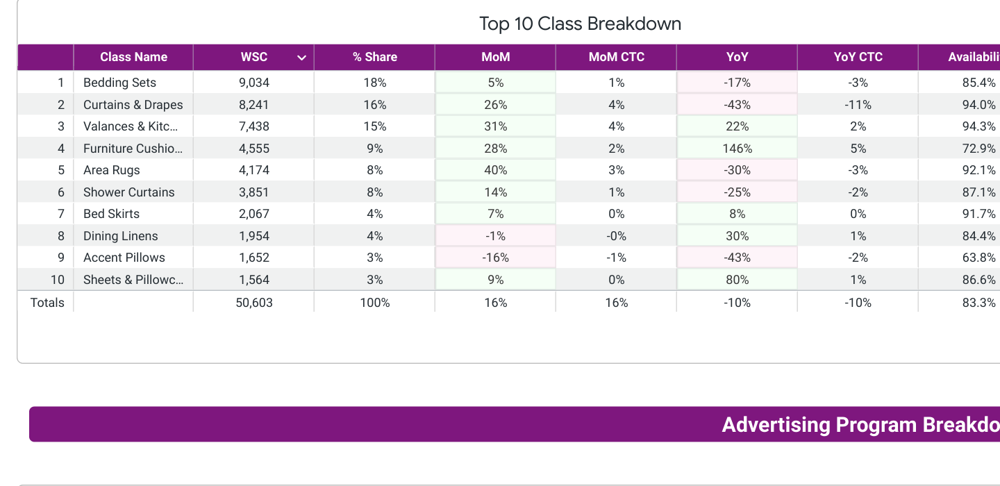
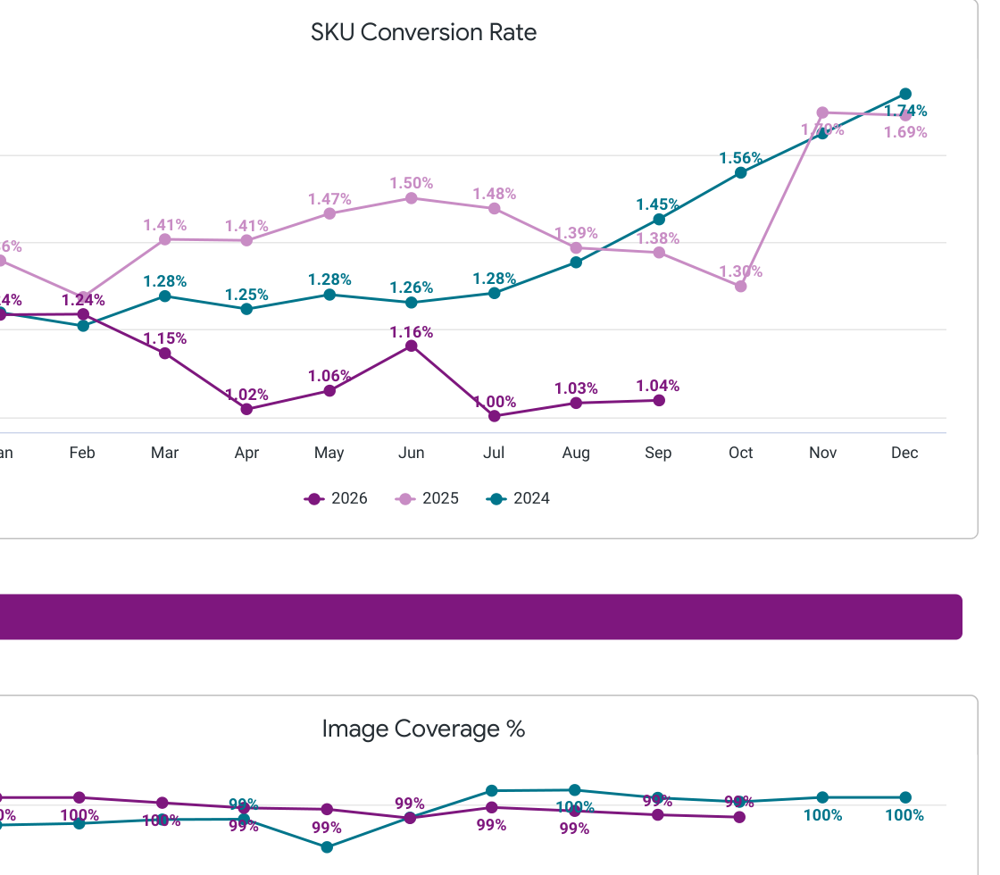

Hi Team,

I am looking forward to meeting you today! Below is your September performance report. I would love to walk through some of these numbers and talking points in our call. Feel free to come with any agenda items of your own!

**Business Review September**

- **$50.6K in WSC (+16% MoM, -10% YoY)**
  - MoM trend under indexed the overall Window category
  - YoY trend under indexed the Window category
  - Top Classes:

- **Traffic:**
  - 145k SKU Visits (-1% MoM, +5% YoY)
    - YoY trends under indexed the Window category
    - MoM under indexed the Window category
  - 1.04% CVR in September

Key Point: Conversion is soft vs the Window category (1.04% vs category CVR) and remains a clear gap versus category growth.

- **Availability**
  - September Global Availability: 83.3%
    - Over indexing category
  - Key Ask: Looks like this is all set. Glad to see continual health here.

- **Advertising**
  - Did not advertise in September
    - Key Point: Last ad activity was in May. Is there a plan to restart advertising?

- **Promotions**
  - Key Ask: I would recommend lining up participation in upcoming Major Shopping Holidays to help close the conversion / YoY gap vs the Window category.

- **Conditional Offers**
  - Happy to keep building on Conditional Offers where incrementality looks healthy — bring any new offer ideas to the call.

**Open Issues**
- Multisource / media / exclusivity items: bring any open tickets you want to walk through and I’ll come prepared with status.

Ben
